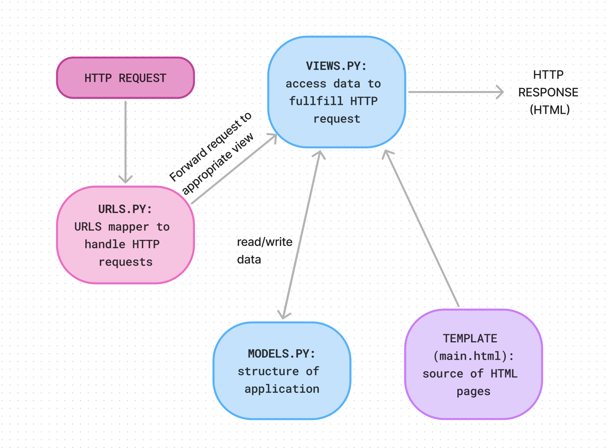
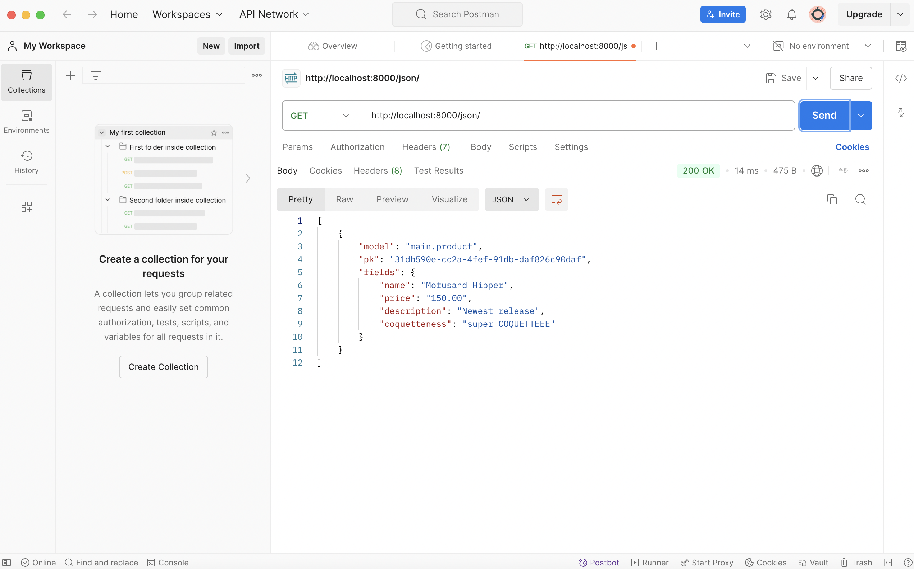
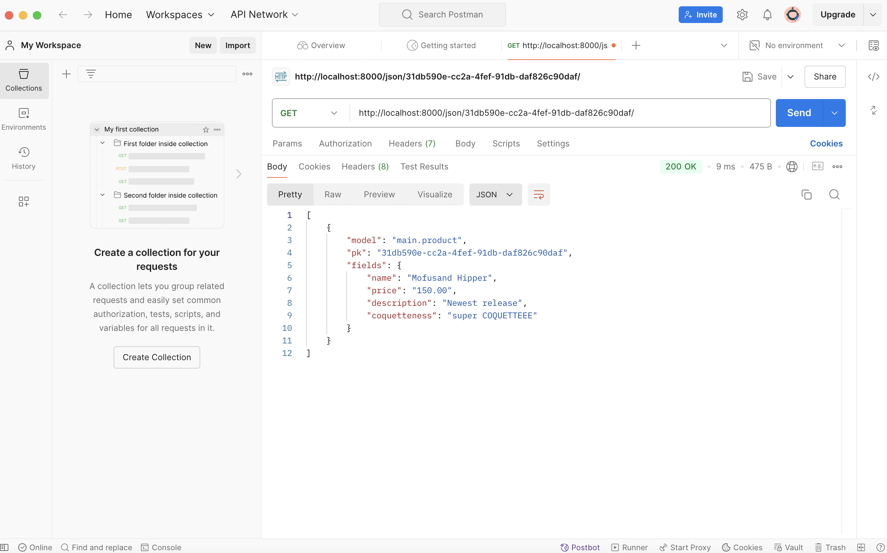
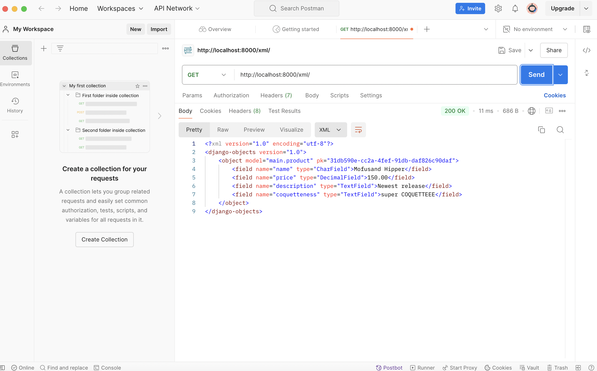
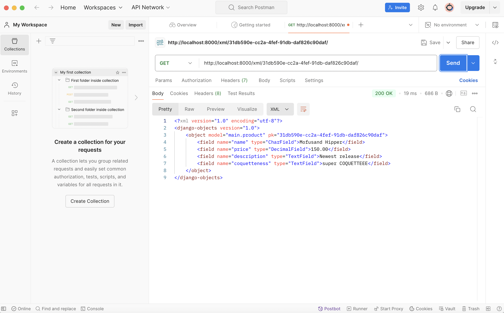

# 🎀 🐈  PINKY PROMISE SHOP!!  🐈 🎀


## [LINK TO PINKY PROMISE'S PWS APP](https://samuella-putri-pinkypromise.pbp.cs.ui.ac.id/)

# ASSIGNMENT 2
### 1. HOW I IMPLEMENTED THE CHECKLISTS


#### A. CREATING A NEW DJANGO PROJECT
 1. I started by initializing a git configuration with git init inside a folder I created (pinky-promise), pinky-promise itself will become the name of my store that I created
 2. next I configured my email and username that i use in GitHub and also configured the authentication with the brew install git-credential-manager-core command, then verify it with 
 ```
 git config --list
 ```
 3. After that, I initialized a repository in github. I created a repository with the name pinky-promise
 4. Then back in the terminal, I created a new main branch with the command 
 ```
 git branch -M main
 ```
and connected it with my github repository with the command 
 ```
 git remote add origin HTTPS URL
 ```
 5. Then I created a virtual environment with the command 
 ```
 python3 -m venv env 
 ```
 and activated it with 
 ```
 source env/bin/activate 
 ```
 command
 6. After that I created a requirements.txt file inside the directory with some dependencies, then installed it with the command 
```
 pip install -r requirements.txt
```
 7. After that I created a django project with a command 
```
 django-admin startproject pinky-promise 
```
 8. Next I configured the project with a few steps. Firstly I edited the allowed hosts to become 
```
 ALLOWED_HOSTS = ["localhost", "127.0.0.1"] 
```
 for some deployment needs.
 
 9. Then I ran the django server with the command python3 manage.py runserver
 10. I also made sure that the django application has been created successfully using the link http://localhost:8000
 11. Then I added a gitignore file which is a configuration file used in the Git repository to specify the files and directories that should be ignored by Git.
 12. Then I did the usual add commit push commands to push any changes from the directory
#### B. CREATING AN APPLICATION NAMED "MAIN" IN THE PROJECT
 After that, inside the main app directory, I created a new main.html file in which I will be displaying my store name, my name, and also my class.
#### C. PERFORM ROUTING IN THE PROJECT SO THAT THE APPLICATION MAIN CAN RUN 
I created urls.py in the main director and filled it with. This will be responsible for managing the URL routing related to the main application.
#### D.  CREATE A MODEL IN THE APPLICATION MAIN 
 1. I modified the models.py file located in the main directory to store a few attributes. The attributes are as follows: 
```
 from django.db import models
 
 class Product(models.Model):
    name = models.CharField(max_length=255)
    price = models.DecimalField(max_digits=10, decimal_places=2)
    description = models.TextField()
    coquetteness = models.TextField()

    def __str__(self):
        return self.name
```
 2. After that, I did the steps to make & apply model migrations  
 3. first of all, I ran 
 ```
 python3 manage.py makemigrations 
 ```
 to make model migrations
 
 4. after that, i ran 
 ```
 python3 manage.py migrate 
 ```
 to apply migrations to the local database

#### E. CREATE FUNCTION VIEWS.PY
 1. I integrated the mvt components with a few steps. 
 2. firstly I created a views.py file in the main application file and filled it as follows 
 ```
 from django.shortcuts import render
 def show_main(request):
    context = {
        'name': 'Samuella Putri Nadia Pauntu',
        'store_name': 'PINKY PROMISE',
        'class': 'PBP KKI',
    }
    return render(request, 'main.html', context)
```
 3. then i applied model modification to my main.html file to display data that has been retrieved from the mode. the inside of it is as follows:
 ```
 <h1>HI! Welcome to {{ store_name }}!!!</h1>


<h2>Name</h2>
<p>{{ name }}</p>

<h2>Class</h2>
<p>{{ class }}</p>
```

#### F. CREATE A ROUTING IN URLS.PY FOR THE APPLICATION MAIN 
I opened the urls.py file inside of the pinky_promise project directory and added it up with the following code under the available explanation with the following:
```
from django.contrib import admin
from django.urls import path, include

urlpatterns = [
    path('admin/', admin.site.urls),
    path('', include('main.urls')),
]

```
#### G. PERFORM DEPLOYMENT TO PWS
1. Before deploying to PWS I created a .gitignore file inside of my pinky_promise directory
2. I did the add, commit, push command from the local repository directory to github to push any changes
3. Next I accessed the PWS website through the link https://pbp.cs.ui.ac.id/web/
4. Then I created a new project with the name ' pinkypromise '
5. After clicking on Create New Project, I went back to my vscode and opened the settings.py file in the pinky_promise directory and added my PWS deployment url to it, making it become: 
```
ALLOWED_HOSTS = ["localhost", "127.0.0.1", "samuella-putri-pinkypromise.pbp.cs.ui.ac.id"]
```
6. Then, I did the add, commit, push commands to push the changes to the github repository
7. After that, I run the information in the Project Command on the PWS page and change the branch name to main with the following command:
```
git branch -M main
```
8. After that I ran the push pws master command to push any changes in the Django project to PWS.
```
git push pws main:master
```
9. After doing all of the steps, I did some checking to the building status of the PWS deployment (whether its still being built or its successfully built). I did that in order to check wether I made any mistakes during the deployment steps and to fix any errors if any.


### 2. DIAGRAM THAT CONTAINS REQUEST CLIENT TO A DJANGO-BASED APPLICATION AND THE RESPONSE IT GIVES. 



When a user makes a request by visiting a specific URL, Django first checks the urls.py file to find a matching route for that URL. Once match is found, it directs the request to the corresponding view function in views.py. The view function contains the business logic and often interacts with the data models, which are defined in models.py, to retrieve or modify information from the database. After gathering the necessary data, the view function passes it to an HTML template, where the data is rendered and formatted for display. The HTML file, located in the templates folder, then dynamically presents the data and is returned as a response to the user's browser, completing the request-response cycle. 

### 3. USAGE OF GIT IN SOFTWARE DEVELOPMENT
 GIT itself is a powerful tool widely used for source code management. It plays a crucial role in software development due to its efficient branching system, where branches are both easy to merge and lightweight. This enables the use of a feature branch workflow, which provides an isolated environment for each change made to the codebase. This workflow allows developers to work on new features, bug fixes, or experiments without affecting the main codebase until the changes are thoroughly tested and reviewed.
### 4. WHY IS DJANGO USED AS A STARTING POINT FOR LEARNING SOFTWARE DEVELOPMENT
 Based on my personal experience, I felt like Django is an easy to use web framework. Django also allows us to write our desired app without having to reinvent the wheel since Django takes care of much of the web development hassle. Here's some further explanation on some advantages of using Django as a starting point for lewarning software development.
 #### 1. Comprehensive Framework: 
 Django is a full-stack web framework, providing verything needed to develop web applications. This includes URL routing, database management, user authentication, and form handling. This makes django very beginner friendly to those wanting to learn core concepts without having to build everything from scratch
 #### 2. Real-world Application: 
 Learning Django equips beginners with skills we can use in real-world projects, since many professional web-appliations are built using Django.
### 5. WHY IS THE DJANGO MODEL CALLED ORM
 Django's ORM provides a way to interact with the database using Python code through models, abstracting away the underlying SQL queries, making it easier to work with databases in an object-oriented fashion. Django's model itself is called ORM due to a few reasons.
 ##### 1. Object-Relational Mapping: 
 It maps Python objects (like classes) to relational database tables, creating a bridge between the two different paradigms: the object-oriented world and the relational database world.
 #### 2. Model: 
 In Django, each database table is represented by a model. This model is a Python class that defines the structure of the table, including the fields and methods (which can encapsulate behavior related to that table).


# ASSIGNMENT 3
### 1. WHY WE NEED DATA DELIVERY IN IMPLEMENTING A PLATFORM
Data delivery is something that is considered essential in any data-driven organisation. Here are a few key reasons why data delivery is important:
#### Security:
In terms of security, it secures data delivery protocols, such as encryption during transmission, ensure that sensitive information is protected from interception or attacks, especially when dealing with personal or financial data.
#### Data Integrity: 
The correct and proper delivery mechanisms ensure that the data remains accurate and complete from the source to the destination. This is critical for applications that rely on precise data, such as healthcare platforms, e-commerce transactions, or data analytics tools.
#### User Experience:
Fast and reliable data delivery directly impacts the user experience. If data is delayed or delivered inefficiently, users may experience lag, slow loading times, or incomplete content, which can lead to frustration and a negative perception of the platform.


### 2. XML VS JSON, WHICH ONE IS BETTER?
The main difference between XML and JSON lies in their structure and syntax. JSON is built on key-value pairs, while XML relies on end tags. Structurally, XML tends to be more complex than JSON because it offers a more intricate representation of attributes. JSON, however, is more widely used due to its simpler, more flexible format for data exchange. Additionally, JSON is better supported by modern programming languages and software systems, making it a more popular choice than XML.

### 3. FUNCTIONAL USAGE OF is_valid() METHOD IN DJANGO FORMS
The purpose of is_valid() is to validate each field in a form. It returns True if all fields pass the validation rules and False if any field fails. Additionally, is_valid() helps with error handling by providing a list of error messages, which can be accessed via the form.errors attribute.

The is_valid() method is valuable in forms for several reasons. Here are some key benefits:

#### Data Integrity 
is_valid() ensures that only correctly formatted and valid data is processed through the form, protecting the application from invalid or harmful input and preserving data integrity.

#### Error Feedback 
is_valid() enables developers to offer users clear error messages when invalid data is entered, enhancing the overall user experience.


### 4. WHY DO WE NEED csrf_token WHEN CREATING A FORM IN DJANGO
Django generates a unique CSRF token for when a user is authenticated an surfing a web. This token is used to verify that the request is coming from the authenticated user and not from a malicious source. CSRF's protection is mainly focusing on protecting against actions that make changes in data. 

When CSRF is not used, the application becomes vulnerable to the CSRF attacks themselves. Any form submission can be spoofed by any attacker, leading to unauthorized actions on behalf of the user.

Attackers could leverage this through a few forms:
#### Force Unwanted Actions: 
An attacker could create a form on another website that, once submitted by the victim (unknowingly), sends a request to the targeted Django application. This request would seem valid to the server because it comes from an authenticated user, but the form's action could lead to unintended consequences, such as modifying user settings, deleting an account, or transferring funds.

#### Bypass Authentication:
If a user is logged in and the attacker knows the URLs and activities expected by the server, the attacker can use CSRF attacks to perform actions that users would typically authenticate for, such as passwords. 

#### Hijacking User Sessions:
Attacker can make attacks using the user's sessions, meaning, they can perform any action the user has permission for. They can perform malicious actions without the user noticing them. 

### 5. HOW I IMPLEMENTED THE CHECKLISTS
#### A. Create a form input to add a model object to the previous app.
1. I created a new file forms.py in the main directory to create the structure of the form which will be recieving the data entries of the pre-ordered items in Pinky Promise.
 ```
from django.forms import ModelForm
from main.models import Product

class ProductEntryForm(ModelForm):
    class Meta:
        model = Product
        fields = ["name", "description", "price", "coquetteness"]
 ```

2. Then i accessed the views.py file in the main directory to add some imports and also make a function create_product_entry which will be receiving the product entries 
```
from django.shortcuts import render, redirect 
from main.forms import ProductEntryForm
from main.models import Product
```
```
...
def create_product_entry(request):
    form = ProductEntryForm(request.POST or None)

    if form.is_valid() and request.method == "POST":
        form.save()
        return redirect('main:show_main')

    context = {'form': form}
    return render(request, "create_product_entry.html", context)
```

3. I changed the show_main function by adding Product.objects.all() which will retrieve all objects of the Product objects stored in the database

```
def show_main(request):
    product_entries = Product.objects.all() # added this
    context = {
        'name': 'Samuella Putri Nadia Pauntu',
        'store_name': 'PINKY PROMISE',
        'class': 'PBP KKI',
        'product_entries': product_entries # added this
    }
    return render(request, 'main.html', context)
```

4. After that I moved to urls.py in the main directory to import the create_product_entry function that I just created. 

```
from main.views import show_main, create_product_entry
```

5. I also added the url path to urlpatterns in the same file 
```
urlpatterns = [
   ...
   path('create-product-entry', create_product_entry, name='create_product_entry'),
]
```

6. I created a new HTML file with the name create_product_entry.html (which will be used to add the new product entry) in the main/templates directory with its contents as follows:
```
 

<h1>Add New Product Entry</h1>

<form method="POST">
  
  <table>
    {{ form.as_table }}
    <tr>
      <td></td>
      <td>
        <input type="submit" value="Add Product Entry" />
      </td>
    </tr>
  </table>
</form>


```

7. Then, I fixed the main.html file and use the  block to present the form data in a table format, along with an "Add Product Entry" button that will navigate to the form page.
```


<h1>Hi!! Welcome to {{ store_name }}</h1>

<h5>Name:</h5>
<p>{{ name }}</p>

<h5>Class:</h5>
<p>{{ class }}</p>


<p>There are currently no product in stock yet. Please pre-order by clicking the add new product below.</p>

<table>
  <tr>
    <th>Product Name</th>
    <th>Price</th>
    <th>Description</th>
    <th>Coquetteness</th>
  </tr>

   This is how to display mood data
   
  
  <tr>
    <td>{{product_entry.name}}</td>
    <td>{{product_entry.price}}</td>
    <td>{{product_entry.description}}</td>
    <td>{{product_entry.coquetteness}}</td>
  </tr>
  
</table>


<br />

<a href="">
  <button>Add New Product Entry</button>
</a>

```
#### B. Add 4 views to view the added objects in XML, JSON, XML by ID, and JSON by ID formats.
1. First I added some imports to the views.py file
```
from django.http import HttpResponse
from django.core import serializers
```

2. Next, I created four functions that take 'request' as a parameter and define a variable within each function to store the result of querying all the data from Product. This will allow us to view the added entries/objects in XML, JSON, XML by ID, and JSON by ID.

``` 
def show_xml(request):
    data = Product.objects.all()
    return HttpResponse(serializers.serialize("xml", data), content_type="application/xml")

def show_json(request):
    data = Product.objects.all()
    return HttpResponse(serializers.serialize("json", data), content_type="application/json")

def show_xml_by_id(request, id):
    data = Product.objects.filter(pk=id)
    return HttpResponse(serializers.serialize("xml", data), content_type="application/xml")

def show_json_by_id(request, id):
    data = Product.objects.filter(pk=id)
    return HttpResponse(serializers.serialize("json", data), content_type="application/json")
```

#### C. Create URL routing for each of the views added in point 2.

1. I import the functions to the urls.py file
```
from main.views import show_main, create_mood_entry, show_xml, show_json, show_xml_by_id, show_json_by_id
```

2. Then, I included the URL path in the urlpatterns variable within the urls.py file located in the main directory, which will be allowing access to the functions that I created previously.
```
urlpatterns = [
    path('', show_main, name='show_main'),
    path('create-product-entry', create_product_entry, name='create_product_entry'), 
    path('xml/', show_xml, name='show_xml'), # this line
    path('json/', show_json, name='show_json'),  # this line
    path('xml/<str:id>/', show_xml_by_id, name='show_xml_by_id'),  # this line
    path('json/<str:id>/', show_json_by_id, name='show_json_by_id'),  # this line

]
```

### SCREENSHOT OF POSTMAN
JSON

JSON by ID

XML

XML by ID


# ASSIGNMENT 4
### 1. DIFFERENCE BETWEEN HttpResponseRedirect() and redirect()?
#### HttpResponseRedirect() :
This is used to redirect the user to a specified URL. To use this, we provide the target URL as a parameter
#### redirect() :
This is a shortcut function that provides a simpler and more flexible way to perform redirects. It can accept not only a URL string but also a view name or an object.

### 2. EXPLAIN HOW PRODUCT IS LINKED WITH USER!
To link Product with User, we need to establish a Foreign key relationship. This allows each Product to be associated with a specific user, making it possible to track which user created each product entry. Here are the steps to implement it :
1. Importing the user model in models.py :
```
from django.contrib.auth.models import User
```
2.  Define the Product model with a ForeignKey to User :
```
class Product(models.Model):
    user = models.ForeignKey(User, on_delete=models.CASCADE)
```
3. Using the Relationship in views.py
```
from django.shortcuts import render
from main.models import Product
def show_main(request):
    product_entries = Product.objects.filter(user=request.user)
    context = {
        'name': request.user.username,
        ...
        'product_entries': product_entries , 
        ...
    }
    return render(request, 'main.html', context)
```
4. Accessing the User in Templates:
```
  
  <tr>
    <td>{{product_entry.name}}</td>
    <td>{{product_entry.price}}</td>
    <td>{{product_entry.description}}</td>
    <td>{{product_entry.coquetteness}}</td>
  </tr>
  
</table>
```

### 3. DIFFERENCE BETWEEN AUTHENTICATION & AUTHORIZATION, WHAT HAPPENS WHEN A USER LOGS IN?
Authentication: verifies a user who they claim to be. The identity of the users are checked in order to provide access to the system. 
Authorization: determines what an authorized user is allowed to do. In this process, the user's authorities are being checked to access the resources.

#### What happens when a user logs in
1. Users enters the username and password (providing credentials)
2. Authentication occurs when the system checks the validity of the credentials against the stored data (The system will deny if credentials don't match and will accept if credentials match)
3. Once logged in, a session is created on the server and a session cookie is sent to the client. This session identifies the user on subsequent requests without requiring them to log in again.
4. Django stores information about the logged-in user in the session, allowing the system to know which user is making the requests.

#### How Django implements authentication 
Django provides built-in tools for managing authentication via its "django.contrib.auth" module. Django provides a default login view that handles authenticating users.

```
from django.contrib.auth import authenticate, login,

def login_user(request):
   if request.method == 'POST':
      form = AuthenticationForm(data=request.POST)

      if form.is_valid():
          user = form.get_user()
          login(request, user)
          response = HttpResponseRedirect(reverse("main:show_main"))
          response.set_cookie('last_login', str(datetime.datetime.now()))
          return response
   else:
      form = AuthenticationForm(request)
   context = {'form': form}
   return render(request, 'login.html', context)

```
After successful authentication, Django uses sessions to keep track of the logged-in user by storing a session cookie in the user's browser. The logout() function ends the session and removes the authentication cookie as well as logging the user out.

#### How Django implements authorization
Once a user is authenticated, Django uses permissions and groups to handle authorization. Each model in Django can have associated permissions, in which these permissions are automatically created when we define models 

```
@login_required(login_url='/login')
def show_main(request):
    product_entries = Product.objects.filter(user=request.user)
    ...
```
In this part of the code, "@login_required" ensures only logged users are allowed to access show_main view

### 4. HOW DOES DJANGO REMEMBER LOGGED IN USERS?
1. Once a user logs in, a session is created by the server to keep track of the user's authenticated state. 
2. Django stores a session ID in a cookie on the user's browser. The session ID in the cookie links its users browser to the session data stored on the server
3. Django stores user-specific information, such as the user's ID and other session-related data, on the server sid. On each request, Django reads the session ID from the cookie, retrieves the corresponding session data from the server, and associates it with the user making the request.

#### Other use of cookies
1. Persistent Logins: Cookies can store login information to keep users logged in between sessions
2. Preferences: Cookies can be used to store user preferences such as language settings, themes, or other personalized configurations.
3. Shopping Carts: Cookies can be used to store temporary shopping cart information in e-commerce sites, allowing users to resume their shopping session.

#### Are All Cookies Safe to Use?
Not all cookies are equally safe, and certain precautions are required when using cookies. Here are a few examples:
1. Secure Cookies: Should only be sent over HTTPS to avoid interception.
2. HttpOnly Cookies: Prevent access via JavaScript, reducing XSS risks.
3. SameSite Cookies: Help prevent CSRF attacks by limiting cross-site requests.
4. Third-Party Cookies: Often used for tracking, raising privacy concerns and are blocked by many browsers.

### 5. HOW I IMPLEMENTED THE CHECKLISTS
####  Implement the register, login, and logout functions so that the user can access the application freely.
1. Firstly, I activated my virtual environment
2. Next I added a few imports to my views.py file and added a register function which will automatically generate the registration form and will be used to create a user account
```
from django.contrib.auth.forms import UserCreationForm
from django.contrib import messages
...
def register(request):
    form = UserCreationForm()

    if request.method == "POST":
        form = UserCreationForm(request.POST)
        if form.is_valid():
            form.save()
            messages.success(request, 'Your account has been successfully created!')
            return redirect('main:login')
    context = {'form':form}
    return render(request, 'register.html', context)
```
3. Then i opened the main/templates directory and added a new file "register.html" with contents as follows:
```
 
<title>Register</title>
 

<div class="login">
  <h1>Register</h1>

  <form method="POST">
    
    <table>
      {{ form.as_table }}
      <tr>
        <td></td>
        <td><input type="submit" name="submit" value="Register" /></td>
      </tr>
    </table>
  </form>

  
  <ul>
    
    <li>{{ message }}</li>
    
  </ul>
  
</div>


```
4. After that, I did the routing by adding the register function to urls.py and added a URL path to urlpatterns to access the imported function.
```
from main.views import register
...
 urlpatterns = [
     ...
     path('register/', register, name='register'),
     ...
 ]
 ```
 5. Before creating the Login function, i added a few imports to the views.py file then added the login function afterwards
 ```
from django.contrib.auth.forms import UserCreationForm, AuthenticationForm
from django.contrib.auth import authenticate, login
...
def login_user(request):
   if request.method == 'POST':
      form = AuthenticationForm(data=request.POST)

      if form.is_valid():
            user = form.get_user()
            login(request, user)
            return redirect('main:show_main')

   else:
      form = AuthenticationForm(request)
   context = {'form': form}
   return render(request, 'login.html', context)
 ```
 6. Then I created a new HTML file with name "login.html" at the main/templates directory with content as follows:
 ```



<title>Login</title>



<div class="login">
  <h1>Login</h1>

  <form method="POST" action="">
    
    <table>
      {{ form.as_table }}
      <tr>
        <td></td>
        <td><input class="btn login_btn" type="submit" value="Login" /></td>
      </tr>
    </table>
  </form>

  
  <ul>
    
    <li>{{ message }}</li>
    
  </ul>
   Don't have an account yet?
  <a href="">Register Now</a>
</div>


```
7. Then I did the routing as usual by importing the login function to urls.py and added the url path
```
from main.views import login_user
...
urlpatterns = [
   ...
   path('login/', login_user, name='login'),
]
```
8. To implement the logout function, I started by adding a few imports to my views.py file and then add the logout function
```
from django.contrib.auth import logout
...
def logout_user(request):
    logout(request)
    return redirect('main:login')

```
9. Then I opened the main.html file and added this line after the "Add New Product Entry" hyperlink tag:
```
...
<a href="">
  <button>Logout</button>
</a>
...
```
10. Then I did the routing by importing the function to urls.py and added the url path
```
from main.views import logout_user
...
urlpatterns = [
   ...
   path('logout/', logout_user, name='logout'),
]
```
11. Then, I restricted the access to the main page by adding a login_required import in views.py
```
from django.contrib.auth.decorators import login_required
```
12. Then i added this code snippet so that the main page can only be accessed by users that have logged-in.
```
...
@login_required(login_url='/login')
def show_main(request):
...

```
####  Make two user accounts with three dummy data each, using the model made in the application beforehand so that each data can be accessed by each account locally.
1. To do this, firstly I accessed http://localhost:8000/ by running 
```
python3 manage.py runserver
```
2. Then I registered one new account
3. Once registered, there are no product entries so I added 3 product entries to that user with specifications for name, price, coquetteness and description
4. I logged-out and did all the same steps for one more account then logged-out again

#### Connect the models Product and User.
1. First, I imported User to models.py
```
from django.contrib.auth.models import User
```
2. Then I added this following code to my Product model:
```
class Product(models.Model):
    user = models.ForeignKey(User, on_delete=models.CASCADE)
```
3. After that, I modified the show_main function in views.py to the following:
```
def show_main(request):
    product_entries = Product.objects.filter(user=request.user)
    context = {
        'name': request.user.username,
        'store_name': 'PINKY PROMISE',
        'class': 'PBP KKI',
        'product_entries': product_entries , 
    }
    return render(request, 'main.html', context)

```
This will display the Product objects associated with the logged-in user

4. Then I ran this command to ran model migration :
```
python3 manage.py makemigrations
```
5. And then applied migration with the following command:
```
python3 manage.py migrate
```
6. Then I imported OS and changed the variable DEBUG in settings.py in the pinky-promise subdirectory to ensure my project is ready for a production environtment
```
import os
...
PRODUCTION = os.getenv("PRODUCTION", False)
DEBUG = not PRODUCTION
```
#### Display logged in user details such as username and apply cookies like last login to the application's main page.
1. First I added a few imports to views.py
```
import datetime
from django.http import HttpResponseRedirect
from django.urls import reverse
```
2. Next, I added the functionality to set a cookie named last_login to track when the user last logged in by fixing this code to if form.is_valid() block in the login_user function:
```
...
if form.is_valid():
    user = form.get_user()
    login(request, user)
    response = HttpResponseRedirect(reverse("main:show_main"))
    response.set_cookie('last_login', str(datetime.datetime.now()))
    return response
...
```
3. Then I added this code snippet in the show_main function
```
'last_login': request.COOKIES['last_login']
```
This will ad the last_login cookie information to the response and this will be displayed in the web page.

4. I modified the logout_user function to the following:
```
def logout_user(request):
    logout(request)
    response = HttpResponseRedirect(reverse('main:login'))
    response.delete_cookie('last_login')
    return response
```
5. Then I added the following code snippet to main.html (under the logout button) to display lastlogin data

```
...
<h5>Last login session: {{ last_login }}</h5>
...
```

# ASSIGNMENT 5
### 1. PRIORITY ORDER OF CSS SELECTORS
1) Inline Style:
Highest specificity because it directly applies to an HTML element.
2) ID Selector:
IDs have a higher specificity than classes and element selectors.
3) Classes, Pseudo Classes, and Attributes:
These selectors have lower specificity than IDs but are higher than element selectors.
4) Element Selectors and Pseudo-Elements:
The lowest specificity.

### 2. WHY DOESS RESPONSIVE DESIGN PLAY AN IMPORTANT CONCEPT IN WEB APPLICATION DEVELOPMENT
Responsive design reduces the amount of data and code that needs to be loaded and eliminates the need to redirect users to device-specific versions of a site. Its primary goal is to ensure that a web application delivers an optimal viewing and interaction experience, no matter the device being used.

APPLICATIONS THAT HAVE IMPLEMENTED RESPONSIVE DESIGN:
- GitHub: This website offers a consistent experience across every device. 
- DropBox: This website's layout adapts to the user's device, providing a seamless experience across devices. For example, the mobile app simplifies common tasks, while the desktop experience is improved with improvements to Windows Explorer, macOS Finder, and the taskbar/menu bar

APPLICATIONS THAT HAVE NOT IMPLEMENTED RESPONSIVE DESIGN:
- Older Government Websites:  Some older government websites, such as certain local administrative portals, have not adopted responsive design. On mobile devices, these websites can be hard to navigate, with small text, misaligned elements, and non-functional features.
- Legacy Corporate Portals: Some older intranet systems or corporate portals were designed specifically for desktop environments. Without responsive updates, these applications offer a poor experience on mobile devices, often requiring excessive zooming and scrolling.

### 3. DIFFERENCES BETWEEN MARGIN, BORDER, AND PADDING.
1. Margin: Margin is the outermost space around the element's border and it clears the area outside the border.
2. Border: Border is the space between an element's padding and the element's content. 
3. Padding: Clears an area around the content.

HOW TO IMPLEMENT THESE:
1. Margin:
```
.element {
  margin: 20px;
}

.element {
  margin-top: 5px;
  margin-right: 10px;
  margin-bottom: 20px;
  margin-left: 30px;
}

```
2. Border:
```
.element {
  border: 5px;
}

.element {
  border-top: 5px red;
  border-right: 5px green;
  border-bottom: 5px blue;
  border-left: 5px red;
}
```
3. Padding:
```
.element {
  padding: 40px;
}

.element {
  padding-top: 15px red;
  padding-right: 20px green;
  padding-bottom: 25px blue;
  padding-left: 35px red;
}
```

### 4. CONCEPTS OF FLEXBOX AND GRID LAYOUT 
#### FLEXBOX: 
Flexbox offers greater control over alignment and space distribution between items. Since it's one dimentional, it only deals with columns and rows.

Uses:
- Navigation Bars: Flexbox is often used to create navigation bars where items need to be evenly spaced or centered.
- Responsive Layouts: Flexbox makes it easy to rearrange elements as the screen size changes, providing a responsive design.

#### GRID: 
Grid has two-dimension layout capabilities which allow flexible widths as a unit of length, so it can manage rows and columns at the same time. 

Uses:
- Dashboards: Grids are great for dashboards with multiple elements like charts, tables, and widgets arranged in a structured layout.
- Complex Page Layouts: Grid is perfect for laying out entire webpages, where you need both rows and columns to organize content.

### 5. HOW I IMPLEMENTED THE CHECKLISTS 
####  Implement functions to delete and edit products.
1. Create two new functions in views.py to delete and edit products:
```
def edit_product(request, id):
    product = Product.objects.get(pk = id)

    form = ProductEntryForm(request.POST or None, instance=product)

    if form.is_valid() and request.method == "POST":
        form.save()
        return HttpResponseRedirect(reverse('main:show_main'))

    context = {'form': form}
    return render(request, "edit_product.html", context)

def delete_product(request, id):
    product = Product.objects.get(pk = id)
    product.delete()
    return HttpResponseRedirect(reverse('main:show_main'))
```

2. Add some imports to views.py:
```
from django.shortcuts import .., reverse
from django.http import .., HttpResponseRedirect

```
3. Next, I created a new HTML file named edit_product.html in the main/templates subdirectory. The inside of it is as follows:
```






<h1>Edit Mood</h1>

<form method="POST">
    
    <table>
        {{ form.as_table }}
        <tr>
            <td></td>
            <td>
                <input type="submit" value="Edit Product"/>
            </td>
        </tr>
    </table>
</form>



```

4. Import the function we created to urls.py and add the url path to access the imported function
```
from main.views import edit_product, delete_product
...
urlpatterns = [
  ...
    path('edit-product/<uuid:id>', edit_product, name='edit_product'),
    path('delete/<uuid:id>', delete_product, name='delete_product'),
]
```

5. After that, I accessed the main.html file in the main/templates folder and modify the code so that there's a delete button for each product.

```
...
<tr>
    ...
    <td>
        <a href="">
            <button>
                Edit
            </button>
        </a>
    </td>
    <td>
        <a href="">
            <button>
                Delete
            </button>
        </a>
    </td>
</tr>
...

```

### 2. Customize the design of the HTML templates that have been created in previous assignments using CSS or a CSS framework (such as Bootstrap, Tailwind, Bulma) with the following conditions:
1. Add the Tailwind cdn script in the head section of the base.html file in the templates folder in the root directory:
```
<head>

    <meta charset="UTF-8" />
    <meta name="viewport" content="width=device-width, initial-scale=1">

<script src="https://cdn.tailwindcss.com">
</script>
</head>

```
Then I added a new folder 'static' with two more folders inside it, 'image' and 'css'. In the 'css' folder, I added a global.css file and filled it with the following code
```
.form-style form input, form textarea, form select {
    width: 100%;
    padding: 0.5rem;
    border: 2px solid #bcbcbc;
    border-radius: 0.375rem;
}
.form-style form input:focus, form textarea:focus, form select:focus {
    outline: none;
    border-color: #d32f93;
    box-shadow: 0 0 0 3px #e54fb1;
}

```

2. I Customized the login page by modifying my login.html to the following:
```




<title>Login</title>



<div class="min-h-screen flex items-center justify-center w-screen bg-pink-100 py-12 px-4 sm:px-6 lg:px-8">
  
  
  
  
  
  
  
  
  <div class="max-w-md w-full space-y-8">
    <div>
      <h2 class="mt-6 text-center text-black text-3xl font-medium-500 text-gray-900" style="font-family: 'Fredoka', sans-serif;">
        Welcome back to Pinky Promise, MofuBuddy!
      </h2>
    </div>
    <form class="mt-8 space-y-6" method="POST" action="">
      
      <input type="hidden" name="remember" value="true">
      <div class="rounded-md shadow-sm -space-y-px">
        <div>
          <label for="username" class="sr-only">Username</label>
          <input id="username" name="username" type="text" required class="appearance-none rounded-none relative block w-full px-3 py-2 border border-gray-300 placeholder-gray-500 text-gray-900 rounded-t-md focus:outline-none focus:ring-pink-500 focus:border-pink-500 focus:z-10 sm:text-sm" placeholder="Username">
        </div>
        <div>
          <label for="password" class="sr-only">Password</label>
          <input id="password" name="password" type="password" required class="appearance-none rounded-none relative block w-full px-3 py-2 border border-gray-300 placeholder-gray-500 text-gray-900 rounded-b-md focus:outline-none focus:ring-pink-500 focus:border-pink-500 focus:z-10 sm:text-sm" placeholder="Password">
        </div>
      </div>

      <div>
        <button type="submit" class="group relative w-full flex justify-center py-2 px-4 border border-transparent text-sm font-medium rounded-md text-white bg-pink-400 hover:bg-pink-600 focus:outline-none focus:ring-2 focus:ring-offset-2 focus:ring-pink-500" style="font-family: 'Fredoka', sans-serif;">
          Sign in
        </button>
      </div>
    </form>

    
    <div class="mt-4">
      
      
            <div class="bg-green-100 border border-green-400 text-green-700 px-4 py-3 rounded relative" role="alert">
                <span class="block sm:inline">{{ message }}</span>
            </div>
        
            <div class="bg-red-100 border border-red-400 text-red-700 px-4 py-3 rounded relative" role="alert">
                <span class="block sm:inline">{{ message }}</span>
            </div>
        
            <div class="bg-blue-100 border border-blue-400 text-blue-700 px-4 py-3 rounded relative" role="alert">
                <span class="block sm:inline">{{ message }}</span>
            </div>
        
      
    </div>
    

    <div class="text-center mt-4" style="font-family: 'Fredoka', sans-serif;">
      <p class="text-sm text-black" style="font-family: 'Fredoka', sans-serif;">
        Haven't registered an account? 
        <a href="" class="font-sans text-pink-400 hover:text-pink-800" style="font-family: 'Fredoka', sans-serif;">
           Become a MofuBuddy now!
        </a>
      </p>
    </div>
  </div>
</div>


```
3. I Customized the register page by modifying my register.html to the following:
```




<title>Register</title>



<div class="min-h-screen flex items-center justify-center bg-pink-100 py-12 px-4 sm:px-6 lg:px-8">
  
  
  
  
  <div class="max-w-md w-full space-y-8 form-style">
    <div>
      <h2 class="mt-6 text-center text-3xl font-medium-500" style="font-family: 'Fredoka', sans-serif;">
        Create your account here! 
      </h2>
    </div>
    <form class="mt-8 space-y-6" method="POST">
      
      <input type="hidden" name="remember" value="true">
      <div class="rounded-md shadow-sm -space-y-px">
        
          <div class="mt-4">
            <label for="{{ field.id_for_label }}" class="mb-2 font-semibold text-black" style="font-family: 'Fredoka', sans-serif;">
              {{ field.label }}
            </label>
            <div class="relative">
              {{ field }}
              <div class="absolute inset-y-0 right-0 pr-3 flex items-center pointer-events-none">
                
                  <svg class="h-5 w-5 text-red-500" fill="currentColor" viewBox="0 0 20 20">
                    <path fill-rule="evenodd" d="M18 10a8 8 0 11-16 0 8 8 0 0116 0zm-7 4a1 1 0 11-2 0 1 1 0 012 0zm-1-9a1 1 0 00-1 1v4a1 1 0 102 0V6a1 1 0 00-1-1z" clip-rule="evenodd" />
                  </svg>
                
              </div>
            </div>
            
              
                <p class="mt-1 text-sm text-red-600">{{ error }}</p>
              
            
          </div>
        
      </div>

      <div>
        <button type="submit" class="group relative w-full flex justify-center py-2 px-4 border border-transparent text-sm font-medium rounded-md text-white bg-pink-400 hover:bg-pink-500 focus:outline-none focus:ring-2 focus:ring-offset-2 focus:ring-pink-500"  style="font-family: 'Fredoka', sans-serif;">
          Register
        </button>
      </div>
    </form>

    
    <div class="mt-4">
      
      <div class="bg-red-100 border border-red-400 text-red-700 px-4 py-3 rounded relative" role="alert">
        <span class="block sm:inline">{{ message }}</span>
      </div>
      
    </div>
    

    <div class="text-center mt-4" style="font-family: 'Fredoka', sans-serif;">
      <p class="text-sm text-black" style="font-family: 'Fredoka', sans-serif;">
        Already have an account?
        <a href="" class="font-medium text-pink-400 hover:text-pink-600" style="font-family: 'Fredoka', sans-serif;">
          Login here
        </a>
      </p>
    </div>
  </div>
</div>


```

4. I Customized the add product page by modifying my create_product_entry.html to the following:
```



<title>Create Mood</title>





<div class="overflow-x-hidden px-4 md:px-8 pb-8 pt-24 min-h-screen bg-pink-100 flex flex-col"
     style="background-image: url(''); background-size: cover; background-position: center; background-repeat: no-repeat;">
  <div class="container mx-auto px-4 py-8 mt-16 max-w-xl">
    <h1 class="text-3xl font-bold text-center mb-8 text-black" style="font-family: 'Fredoka', sans-serif;">Add a New Product Entry!</h1>

  
    <div class="bg-white shadow-md rounded-lg p-6 form-style">
      <form method="POST" class="space-y-6">
        
        
          <div class="flex flex-col">
            <label for="{{ field.id_for_label }}" class="mb-2 font-semibold text-gray-700">
              {{ field.label }}
            </label>
            <div class="w-full">
              {{ field }}
            </div>
            
              <p class="mt-1 text-sm text-gray-500">{{ field.help_text }}</p>
            
            
              <p class="mt-1 text-sm text-red-600">{{ error }}</p>
            
          </div>
        
        <div class="flex justify-center mt-6">
          <button type="submit" class="bg-pink-600 text-white font-semibold px-6 py-3 rounded-lg hover:bg-indigo-700 transition duration-300 ease-in-out w-full">
            Create Product Entry
          </button>
        </div>
      </form>
    </div>
  </div>
</div>



```

4. Then, I modified my main.html or the product list page to the following to make it more attractive:
```




<title>PINKY PROMISE</title>



<div class="overflow-x-hidden px-4 md:px-8 pb-8 pt-24 min-h-screen bg-pink-100 flex flex-col"
     style="background-image: url(''); background-size: cover; background-position: center; background-repeat: no-repeat;">
  <div class="p-2 mb-6 relative">
    <div class="relative grid grid-cols-1 z-30 md:grid-cols-3 gap-8">
      
      
    </div>
</div>
    <div class="flex justify-center mb-6">
        <a href="" class="bg-pink-600 hover:bg-pink-700 text-white font-bold py-2 px-4 rounded-lg transition duration-300 ease-in-out transform hover:-translate-y-1 hover:scale-105">
            Add New product Entry
        </a>
    </div>
    
    
    <div class="flex flex-col items-center justify-center min-h-[24rem] p-6">
        
        <p class="text-center text-gray-600 mt-4">There is no product data!</p>
    </div>
    
    <div class="columns-1 sm:columns-2 lg:columns-3 gap-6 space-y-6 w-full">
        
            
        
    </div>
    
</div>

```
This part of the code will display a Ribbon image with a message if there are no product entries, and will display the product cards if there are any products:
```
    
    <div class="flex flex-col items-center justify-center min-h-[24rem] p-6">
        
        <p class="text-center text-gray-600 mt-4">There is no product data!</p>
    </div>
    
    <div class="columns-1 sm:columns-2 lg:columns-3 gap-6 space-y-6 w-full">
        
            
        
```

5. Now, I modified the product cards (card_product.html) to the following, and also adding edit and delete buttons:

```


<div class="relative break-inside-avoid card-popup cute-bubble-card"> 
  <div class="absolute top-0 left-0 z-50"> 
    
  </div>

  <div class="relative top-5 bg-pink-100 shadow-md rounded-xl mb-6 break-inside-avoid flex flex-col border-2 border-pink-300 transform rotate-1 hover:rotate-0 transition-transform duration-300">
    <div class="bg-pink-200 text-gray-800 p-4 rounded-t-xl border-b-2 border-pink-300">
      <h3 class="font-bold text-xl mb-2" style="font-family: 'Fredoka', sans-serif;">{{ product_entry.name }}</h3>
      <p class="text-gray-600" style="font-family: 'Fredoka', sans-serif;">{{ product_entry.price }} YEN</p>
    </div>
    <div class="p-4">
      <p class="font-semibold text-lg mb-2" style="font-family: 'Fredoka', sans-serif;">Product Description</p>
      <p class="text-gray-700 mb-2" style="font-family: 'Fredoka', sans-serif;">{{ product_entry.description }}</p> 
      <div class="mt-4">
        <p class="text-gray-700 font-semibold mb-2" style="font-family: 'Fredoka', sans-serif;">Coquetteness Intensity</p>
        <p class="text-gray-700" style="font-family: 'Fredoka', sans-serif;">{{ product_entry.coquetteness }}</p> 
      </div>
    </div>
  </div>
  <div class="absolute top-0 -right-4 flex space-x-1">
    <a href="" class="bg-pink-500 hover:bg-yellow-600 text-white rounded-full p-2 transition duration-300 shadow-md">
      <svg xmlns="http://www.w3.org/2000/svg" class="h-9 w-9" viewBox="0 0 20 20" fill="currentColor">
        <path d="M13.586 3.586a2 2 0 112.828 2.828l-.793.793-2.828-2.828.793-.793zM11.379 5.793L3 14.172V17h2.828l8.38-8.379-2.83-2.828z" />
      </svg>
    </a>
    <a href="" class="bg-red-500 hover:bg-red-600 text-white rounded-full p-2 transition duration-300 shadow-md">
      <svg xmlns="http://www.w3.org/2000/svg" class="h-9 w-9" viewBox="0 0 20 20" fill="currentColor">
        <path fill-rule="evenodd" d="M9 2a1 1 0 00-.894.553L7.382 4H4a1 1 0 000 2v10a2 2 0 002 2h8a2 2 0 002-2V6a1 1 0 100-2h-3.382l-.724-1.447A1 1 0 0011 2H9zM7 8a1 1 0 012 0v6a1 1 0 11-2 0V8zm5-1a1 1 0 00-1 1v6a1 1 0 102 0V8a1 1 0 00-1-1z" clip-rule="evenodd" />
      </svg>
    </a>
  </div>
</div>

<style>
  .cute-bubble-card {
    border-radius: 50px; 
  }

  .cute-bubble-card > div {
    border-radius: 50px; 
  }

  .card-popup {
    opacity: 0;
    transform: scale(0.9);
    animation: popup-animation 0.6s ease-out forwards;
  }

  @keyframes popup-animation {
    0% {
      opacity: 0;
      transform: scale(0.9);
    }
    100% {
      opacity: 1;
      transform: scale(1);
    }
  }
</style>
```
### 3. Create a navigation bar (navbar) for the features in the application that is responsive to different device sizes, especially mobile and desktop. 
I created a navbar.html file and filled it with the following code:
```


<nav class="bg-pink-400 shadow-lg fixed top-0 left-0 z-40 w-screen">
  <div class="max-w-7xl mx-auto px-4 sm:px-6 lg:px-8">
    <div class="flex items-center justify-between h-16">
      <div class="flex items-center">
          <h1 class="text-2xl font-medium text-center text-white" style="font-family: 'Fredoka', sans-serif;">PINKY PROMISE</h1>
        
      </div>
      <div class="hidden md:flex items-center">
        
          <div class="text-right mr-4">
            <span class="block text-white-300" style="font-family: 'Fredoka', sans-serif;">Welcome, {{ user.username }}</span>
            <span class="block text-sm text-white-300" style="font-family: 'Fredoka', sans-serif;">Last Login: {{ last_login }}</span> 
          </div>
          <a href="" class="text-center bg-red-500 hover:bg-red-600 text-white font-bold py-2 px-4 rounded transition duration-300">
            Logout
          </a>
        
          <a href="" class="text-center bg-blue-500 hover:bg-blue-600 text-white font-bold py-2 px-4 rounded transition duration-300 mr-2">
            Login
          </a>
          <a href="" class="text-center bg-green-500 hover:bg-green-600 text-white font-bold py-2 px-4 rounded transition duration-300">
            Register
          </a>
        
      </div>
      <div class="md:hidden flex items-center">
        <button class="mobile-menu-button">
          <svg class="w-6 h-6 text-white" fill="none" stroke-linecap="round" stroke-linejoin="round" stroke-width="2" viewBox="0 0 24 24" stroke="currentColor">
            <path d="M4 6h16M4 12h16M4 18h16"></path>
          </svg>
        </button>
      </div>
    </div>
  </div>
  <!-- Mobile menu -->
  <div class="mobile-menu hidden md:hidden  px-4 w-full md:max-w-full">
    <div class="pt-2 pb-3 space-y-1 mx-auto">
      
        <span class="block text-gray-300 px-3 py-2">Welcome, {{ user.username }}</span>
        <span class="block text-sm text-gray-300 px-3 py-2">Last Login: {{ last_login }}</span> 
        <a href="" class="block text-center bg-red-500 hover:bg-red-600 text-white font-bold py-2 px-4 rounded transition duration-300" style="font-family: 'Fredoka', sans-serif;">
          Logout
        </a>
      
        <a href="" class="block text-center bg-blue-500 hover:bg-blue-600 text-white font-bold py-2 px-4 rounded transition duration-300 mb-2" style="font-family: 'Fredoka', sans-serif;">
          Login
        </a>
        <a href="" class="block text-center bg-green-500 hover:bg-green-600 text-white font-bold py-2 px-4 rounded transition duration-300" style="font-family: 'Fredoka', sans-serif;">
          Register
        </a>
      
    </div>
  </div>
</nav>
```
This part of the code displays the hamburger icon for mobile version:
```
<div class="md:hidden flex items-center">
  <button class="mobile-menu-button">
    <svg class="w-6 h-6 text-white" fill="none" stroke-linecap="round" stroke-linejoin="round" stroke-width="2" viewBox="0 0 24 24" stroke="currentColor">
      <path d="M4 6h16M4 12h16M4 18h16"></path>
    </svg>
  </button>
</div>
```